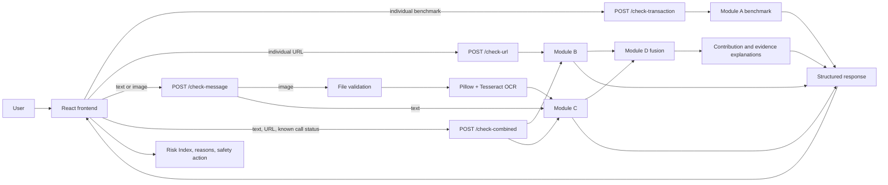
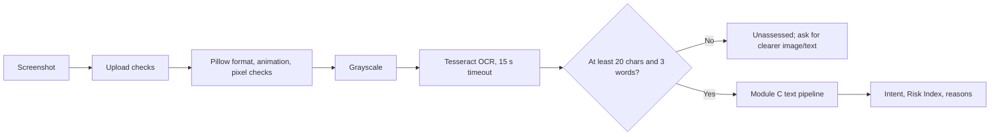
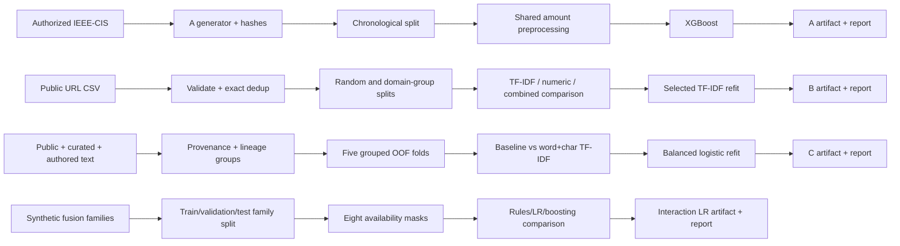

# TrueIntent: Complete Project Explainer

This document describes the repository as it is implemented now. It distinguishes live behavior from historical experiments, rules from learned features, and public data from authored or synthetic data. Source links are relative to the repository root.

## 1. TrueIntent Overview

TrueIntent is a learning prototype for examining evidence around authorised push-payment (APP) and social-engineering fraud. In this setting, the victim is authenticated and sends the payment personally, but a scammer has manipulated the victim's intent through a call, message, impersonation, threat, investment promise, or phishing page. Normal payment authentication can therefore succeed while the payment is still harmful.

The project's intended concept is:

> Transaction context + message intent + URL risk + call/context signals → combined fraud-risk assessment.

Transaction data alone may show an amount or unusual pattern, but it cannot establish why the user is paying. A threatening message may reveal coercion; a URL may resemble a bank login; an active call may indicate real-time pressure. TrueIntent separates these channels into detectors and then uses a fusion layer to model interactions.

There is an important current limitation: live INR transaction scoring and transaction fusion are disabled. Module A is now an explicit, amount-only IEEE-CIS research benchmark in the source dataset's unknown units, and its compatible model artifact is absent. The combined web workflow scores message, URL, embedded-URL, and user-reported call evidence. Entered INR amount, local timestamp, and transfer count remain local display context and are not sent as transaction-model inputs. See [the Module A correction](docs/MODULE_A_CORRECTNESS.md).

## 2. High-Level Architecture



The backend is [FastAPI](backend/app/main.py), with request/response contracts in [schemas.py](backend/app/schemas.py). Modules A–D live in [`ml/`](ml/). The default React screen is Combined Fraud Analysis; individual link, message/screenshot, and transaction-benchmark tabs remain available in [App.jsx](frontend/src/App.jsx).

Individual routes return one module's result. Combined analysis runs the available B and C channels, passes their outputs and optional known call state to D, and returns the component results plus a unified result. A transaction-bearing combined API request is explicitly rejected.

## 3. Complete End-to-End Working Flow

The actual combined workflow is implemented by [combinedAnalysis.js](frontend/src/combinedAnalysis.js), [main.py](backend/app/main.py), and [predict_module_d.py](ml/predict_module_d.py):

1. The user may enter a message, screenshot, URL, amount, local date/time, transfer count, and call status.
2. The browser validates numeric context, the local timestamp, URL scheme/host, and image MIME type/size.
3. Amount, timestamp, and transfer count are retained only in the frontend `context` object. The timestamp string from `datetime-local` is preserved; it is not converted to UTC.
4. If a screenshot exists, the frontend first uploads it to `POST /check-message`. The backend limits the read to 10 MB plus one byte, validates the actual image, and runs OCR in a worker thread.
5. Unreadable or insufficient OCR blocks the combined verdict. Successful OCR text is deduplicated against pasted text and the two are joined.
6. If neither message nor URL remains, the frontend returns an explicit unassessed result without making a combined API call. Transaction/call context alone cannot be scored.
7. The frontend sends message text, normalized URL, and `active_call` only when the user selected Yes or No. “Not sure” is omitted and therefore unknown.
8. FastAPI/Pydantic validates the combined schema. URLs receive additional shared HTTP(S) parsing. Text is limited to 20,000 characters and URLs to 8,192.
9. Module B analyzes an explicitly submitted URL offline. Module C classifies message intent and sends any embedded URLs through Module B.
10. Module D separates C's text score from its embedded URL score, takes the maximum of explicit and embedded URL risk, and represents missing channels with presence flags.
11. The version-2 logistic fusion model produces an uncalibrated synthetic-policy Risk Index. The backend maps it to Low, Medium, High, or Critical.
12. D ranks positive coefficient × feature contributions and names up to three factors. B/C reasons remain available as observed rule matches or model interpretations.
13. FastAPI returns `tier`, `score`, `explanation`, `details`, and per-module results.
14. [CombinedResults.jsx](frontend/src/components/CombinedResults.jsx) displays the overall Risk Index, URL/message indices, reasons, limitations, context, OCR text, and a tier-specific safety action. Transaction risk is shown as unavailable.

## 4. Module A — Transaction Risk Detection

### Current purpose and contract

Module A is a research benchmark, not a live INR or APP-fraud detector. Its current contract is defined once in [features_module_a.py](ml/features_module_a.py) and shared by generation, training, inference, and explanation code. It permits one model feature:

| Feature | Meaning | Source | Preprocessing | Why It Matters |
|---|---|---|---|---|
| `amount` | `TransactionAmt` in original, unspecified IEEE-CIS source units | User-authorized IEEE-CIS `train_transaction.csv` | Numeric `float64`; finite, nonnegative, not Boolean, within float32 range; request must say `amount_unit="ieee_cis_source"` | Amount can correlate with fraud in the benchmark, but amount alone does not establish coercion or translate to INR risk |

`TransactionID` and relative `TransactionDT` are retained only to audit and create a chronological split. They are not predictors. Missing `amount` or `amount_unit`, unsupported INR units, nonfinite/negative values, and incompatible artifacts cause errors rather than imputation or a safe default.

### Model and training

[train_module_a.py](ml/train_module_a.py) trains an `XGBClassifier` with 100 trees, depth 4, learning rate 0.1, histogram trees, seed 42, and a train-only negative/positive class weight. [generate_module_a_data.py](ml/generate_module_a_data.py) copies observed amounts and labels from IEEE-CIS, creates no synthetic substitute, and records hashes. The split is chronological 80/20 using `TransactionDT`; equal timestamps remain together. The evaluated class threshold is 0.5.

The current amount-only artifact `ml/models/module_a.pkl` is absent. `/check-transaction` consequently returns 503 after semantic validation. A future compatible artifact would return a raw XGBoost `predict_proba` value with `analysis_scope="ieee_cis_amount_only_benchmark"`; the UI labels it Benchmark Risk Index, not transfer risk or calibrated probability. It is not passed into the live combined endpoint.

### Removed and disabled features

The former six-feature design used amount, relative-time “hour,” an “odd hour” derivative, inferred velocity, label-conditioned synthetic device novelty, and label-conditioned synthetic call state. These were removed because training and inference meanings did not match or the source data could not justify them. Legacy timestamp, device, call, velocity, and optional `CallTelemetry` fields remain accepted/validated for compatibility but cannot change Module A features. Transaction-bearing combined requests return 422 because D was trained on the obsolete A score distribution.

The historical six-feature report — precision 0.088106, recall 0.686270, F1 0.156163, false-positive rate 0.253113 — was removed during the repository audit, because a stale artifact description for a model that `validate_artifact()` rejects is a trap. The figures are preserved as a labelled historical record in [`data/DATASHEET.md`](data/DATASHEET.md). No amount-only metrics exist in this checkout.

## 5. Module B — URL / Phishing Detection

Module B combines a learned classifier with transparent URL rules in [predict_module_b.py](ml/predict_module_b.py). The selected saved classifier is character TF-IDF (3–5 character n-grams, at most 10,000 features) plus logistic regression. Engineered-only and TF-IDF-plus-engineered models were evaluated, but the conservative selection rule retained TF-IDF because the grouped-validation F1 gain from the combined model was below 0.01.

The data is the public Kaggle/Mendeley Web Page Phishing Detection v2 snapshot collected in May 2020: 11,427 unique URL texts after removing three case-folded duplicates, with 5,715 legitimate and 5,712 phishing labels. The source's precomputed numeric columns are not used. Details are in [data/README.md](data/README.md) and [the evaluation report](docs/MODULE_B_EVALUATION.md).

### Learned engineered features evaluated

All are implemented in [features_module_b.py](ml/features_module_b.py). They are used by the engineered and combined experimental pipelines, but **not by the selected TF-IDF classifier artifact**.

| Feature | Definition |
|---|---|
| `url_length` | Characters in the trimmed URL |
| `hostname_length` | Characters in normalized hostname |
| `path_length` | Characters in parsed path |
| `subdomain_count` | Public-suffix-aware subdomain labels; zero for IP hosts |
| `digit_ratio` | Digit characters divided by URL length |
| `special_character_ratio` | Non-alphanumeric characters divided by URL length |
| `entropy` | Shannon entropy over URL characters |
| `ip_hostname` | Valid IPv4 or IPv6 hostname flag |
| `idn_hostname` | Any hostname label starts with `xn--` after IDNA normalization |
| `suspicious_keyword_count` | Counts of the fixed login/verify/account/password/secure/update/bank/signin/confirm/wallet/payment/support list |
| `encoded_character_count` | Number of `%HH` byte encodings |
| `hostname_hyphens` | Hyphen count in hostname |
| `excessive_hyphens` | Three-or-more hostname hyphens flag |
| `known_shortener` | Exact match to a small fixed shortener hostname list |

URLs are trimmed. Schemeless inputs are parsed as HTTP for analysis; only HTTP(S) is accepted. Hostnames are lowercased, trailing dots removed, and IDNA encoded. `tldextract` uses its bundled public-suffix data with downloads and cache disabled. Live serving does not fetch the destination. `inspect_live_page()` is a no-network compatibility stub, so the default system cannot inspect page HTML, redirects, reputation, certificates, or domain age.

Serving rules assign weights for insecure HTTP (0.20), raw IP (0.40), brand similarity/embedding (0.35), selected high-risk TLDs (0.20), URL obfuscation (0.15), and length over 75 (0.10), capped at 1. The saved classifier produces its class-1 output, and serving returns `0.5 × rule_score + 0.5 × classifier_output`. If the model is unavailable or invalid, the response explicitly says rules-only. These rule weights and the blend were not validated by the classifier evaluation.

The random split leaks domain identity: 452 hostnames and 488 registered domains occur in both sides, affecting 805 and 1,133 test rows respectively. The domain-disjoint split groups by registered domain and has zero shared hostnames, domains, or conservative near-duplicate templates. The stricter result is the better estimate of unseen-domain generalization, although neither split represents current live phishing.

## 6. Module C — Scam Message Intent Detection

Module C is a lightweight, Unicode-preserving text classifier in [features_module_c.py](ml/features_module_c.py) and [predict_module_c.py](ml/predict_module_c.py). The current artifact contains:

- a ten-class intent pipeline;
- a compatibility three-class psychology-signature pipeline (`fear_authority`, `greed_opportunity`, `none`);
- no retained keyword evidence rules.

The selected intent pipeline joins word TF-IDF (1–2 grams, 10,000 maximum) with character-within-word TF-IDF (3–5 grams, 15,000 maximum), then uses balanced logistic regression. Normalization applies Unicode NFKC and case-folding, removes zero-width characters, replaces URLs and email addresses with tokens, and collapses whitespace. A custom tokenizer preserves Devanagari vowel marks better than the default word pattern.

| Class | Meaning | Example behaviour (illustrative, not claimed training text) |
|---|---|---|
| `benign` | Ordinary non-scam communication | “Can we meet at six?” |
| `urgency_pressure` | Time pressure or forced immediate action | “Act immediately or access will be blocked” |
| `authority_fear` | Threats or claimed official authority | “I am an officer; comply now” |
| `digital_arrest` | Digital-arrest or money-laundering intimidation | “Stay on the call during this investigation” |
| `investment_scam` | Guaranteed or implausible returns | “Guaranteed profit if you invest today” |
| `kyc_upi_scam` | False KYC/payment-account update | “Update KYC through this link” |
| `impersonation` | Pretending to be a known person or organization | “I am your manager; send funds” |
| `courier_customs_scam` | Parcel/customs claims and demands | “Your parcel is held; pay a clearance fee” |
| `credential_theft` | Attempts to obtain passwords, OTPs, or login details | “Share the OTP to verify your account” |
| `other_fraud` | Fraud/spam not represented by the specific classes | Generic prize or fee scam |

The assembled evaluation data has 4,724 rows: 4,602 real/public, 63 augmented, 54 synthetic, and 5 manually curated. It is heavily imbalanced: 4,514 benign; 101 `other_fraud`; 18 `authority_fear`; and only 13 in each other specific scam class. Language metadata records 4,602 English-dominant source rows, 59 English authored rows, 54 Hinglish, and 9 Hindi. Authored translations/variants share seed lineage; connected leakage groups also use normalized templates and word-TFIDF cosine similarity ≥0.90. Five grouped out-of-fold folds keep these groups together.

At inference, the intent probabilities are checked for finite, nonnegative values summing to one. Text risk is `1 - P(benign)`. The psychology pipeline supplies a backward-compatible signature. Keyword matches, when present in an artifact, are labeled `rule_evidence` and cannot override score or prediction; the current artifact has an empty rules list. URLs extracted case-insensitively from text are deduplicated, scored by B, and the final C score is `max(text_score, embedded_url_score)`. The two components remain exposed so D can avoid double-counting URL evidence.

The high binary scam F1 does not mean reliable intent classification: overall macro-F1 is only 0.3264. Authority/fear recall is 0.1111, digital-arrest recall 0.0769, and courier/customs recall 0. Hindi/Hinglish diagnostics are authored rather than real-world validation.

## 7. OCR / Screenshot Processing



The frontend and backend accept PNG, JPEG, WebP, and BMP up to 10 MB. The backend reads at most 10 MB plus one byte, verifies the actual format, rejects animation and decompression-bomb warnings, caps decoded size at 10 million pixels, and loads pixels to expose corrupt files. [ocr_module_c.py](ml/ocr_module_c.py) converts the image to grayscale and calls `pytesseract.image_to_string`; the external Tesseract binary must also be installed.

OCR states are `ok`, `insufficient_text`, `ocr_unavailable`, and `invalid_image`. Empty/short OCR, a missing engine, or an unreadable file is never interpreted as low risk. OCR errors can still change, omit, or invent characters in otherwise usable text; there is no OCR confidence threshold, deskewing, contrast enhancement, or explicit Hindi language configuration.

## 8. Module D — Cross-Channel Fusion

Module D implements TrueIntent's cross-channel idea in [features_module_d.py](ml/features_module_d.py) and [predict_module_d.py](ml/predict_module_d.py). The current version-2 artifact is an unscaled logistic regression over 14 features. It was trained on a synthetic policy simulation, not linked real incidents.

| Fusion input | Meaning |
|---|---|
| `module_a_score` | A score, or zero when absent; live API never supplies A |
| `module_b_score` | Maximum explicit/embedded URL score |
| `module_c_score` | Message text risk, separated from embedded URL risk |
| `a_present`, `b_present`, `c_present` | Distinguish missing channel from observed zero |
| `active_call` | 1 only for user-reported Yes |
| `call_known` | Distinguishes omitted/unknown call state from reported No |
| `credential_request` | C's `credential_theft` intent probability |
| `authority_fear` | Sum of C's `authority_fear` and `digital_arrest` probabilities, capped at 1 |
| `message_transaction` | A × C interaction |
| `call_transaction` | A × active-call interaction |
| `url_credentials` | B × credential signal |
| `authority_transaction` | A × authority/fear signal |

All scores must be finite and in [0,1]. Related interactions become zero when a channel is unavailable. Call state alone is insufficient. With the live B+C workflow, A and all A-based interactions are absent; call state is represented but has no standalone interaction feature, so its effect can come only through the model's direct `active_call` and `call_known` coefficients.

The synthetic generator creates 600 independent families: 300 training, 100 validation, and 200 test. Simulated detector scores come from assumed beta distributions. Labels encode severe single-channel evidence or the interactions unusual transaction + message/call/authority and phishing URL + credential request. Each training family is expanded over eight availability masks, yielding 2,400 correlated training rows. This is an invented policy and does not prove fraud detection.

Four approaches were compared: the old three-score logistic model, a simple strongest-signal/corroboration rule, 14-feature logistic regression, and histogram gradient boosting. Logistic interactions were retained for simplicity and exact coefficient explanations. The saved serving model is one logistic model trained across availability masks.

The result is `predict_proba` from that logistic policy, rounded to four decimals and correctly presented as a synthetic-policy **Risk Index**, not calibrated fraud probability. If the artifact is missing, legacy fixed weights A=.45, B=.25, C=.30 are renormalized over available modules. Corrupt/incompatible D artifacts fail visibly.

## 9. Feature Engineering

### Transaction Features

| Name | Type | Source and preprocessing | Consumer |
|---|---|---|---|
| `amount` | float | IEEE-CIS `TransactionAmt`; explicit source unit, finite/nonnegative | A XGBoost benchmark |
| `TransactionDT` | numeric audit field | Relative source time; chronological split only | A trainer, not model |
| `TransactionID` | identifier | Unique ID; ordering/tie-break only | A trainer, not model |

### URL Features

The selected B classifier consumes trimmed raw URL characters through lowercase character TF-IDF. The 14 numeric fields listed in §5 are implemented for evaluated alternative pipelines. Parsing also supplies hostname/IP/IDNA/registered-domain and near-duplicate grouping during validation and audit. Serving-only heuristic indicators include HTTP, raw IP, typosquatting, fixed risky TLDs, `@`, percent encoding, excessive hyphens, and length >75.

### Message Features

| Name | Type | Source and preprocessing | Consumer |
|---|---|---|---|
| word TF-IDF | sparse | Normalized Unicode word unigrams/bigrams | C intent logistic regression |
| character TF-IDF | sparse | Normalized `char_wb` 3–5 grams | C intent logistic regression |
| `P(intent)` | ten floats | Multiclass `predict_proba` | C output and D tactics |
| `text_score` | float | `1 - P(benign)` | C and D |
| psychology signature | category | Separate three-class TF-IDF model | Compatibility/explanation |
| `embedded_url_score` | float | Maximum B score over extracted URLs | C final score and D URL channel |
| rule evidence | structured list | Exact normalized phrase match; no score effect | User evidence; empty in current artifact |

### Context / Call Features

`active_call` is a strict optional Boolean supplied by the user: true, false, or omitted/unknown. The Android `CallTelemetry` schema validates device match and a timezone-aware timestamp within -30/+120 seconds, but Module A ignores its value and the web combined workflow does not use it. Frontend amount, local timestamp, and velocity are display-only context.

### Fusion Features

The complete D feature contract is the 14-row table in §8. Direct scores and presence flags are learned inputs. Four products model corroboration. No beneficiary graph, user history, location, account age, voice, device trust, or live banking telemetry is implemented.

## 10. Risk Score / Risk Index

The displayed value is an uncalibrated **Risk Index**:

- A would expose an XGBoost class output from a class-weighted research benchmark; it is unavailable and uncalibrated.
- B blends a logistic classifier output with hand-set rule weights.
- C uses `1 - P(benign)` and may replace it with a larger embedded-URL score.
- D uses a logistic output learned from synthetic policy labels, or fixed fallback weights if its artifact is missing.

None is a verified percentage probability of real-world fraud. The frontend multiplies a valid 0–1 index by 100 only for an “out of 100” presentation.

Thresholds are defined centrally in [features_module_d.py](ml/features_module_d.py) (`RISK_THRESHOLDS`, re-exported by `predict_module_d.py`) and mirrored for individual results in [api.js](frontend/src/api.js):

| Range | Tier |
|---|---|
| `0 ≤ score < 0.25` | Low |
| `0.25 ≤ score < 0.50` | Medium |
| `0.50 ≤ score < 0.75` | High |
| `0.75 ≤ score ≤ 1` | Critical |

These are hard-coded policy thresholds, not thresholds chosen from deployment calibration or harm/cost analysis.

## 11. Explanation System

Explanations combine different evidence types and should not be treated as causal proof:

- **Observed heuristic evidence:** URL properties such as HTTP, an IP hostname, excessive hyphens, percent encoding, or a brand-like domain. These state what the parser observed and how a fixed rule interpreted it.
- **Model interpretation:** D reports exact logistic `coefficient × feature value` terms relative to an all-zero reference. These reconstruct log-odds with the intercept but are not causal effects or normalized importance.
- **Message interpretation:** C states its top ML intent as an unverified prediction. If rule evidence exists, it is separately marked and has no score effect.
- **Token attribution:** the legacy D path can calculate positive linear TF-IDF coefficient contributions for the C psychology signature and calls them `linear_shap_tokens`. This is an exact linear zero-reference contribution calculation, not use of the SHAP library for the current v2 fusion path.
- **Module A SHAP:** helper code supports tree SHAP for a compatible A transaction result, but the live backend blocks transaction fusion and has no compatible A artifact.

Fictional response shape:

```json
{
  "tier": "High",
  "score": 0.68,
  "explanation": "High synthetic-policy risk index (0.68). Factors: URL risk combined with a model-indicated credential request...",
  "details": {
    "scoring_method": "logistic_interactions_synthetic_policy",
    "availability": {"module_a": false, "module_b": true, "module_c": true},
    "active_call": true,
    "feature_contributions_log_odds": {"module_b_score": 1.2, "url_credentials": 0.7},
    "model_caveat": "Synthetic labels and detector scores; no real incident validation."
  },
  "modules": {
    "module_b": {"score": 0.72, "reasons": ["Potential typosquatting..."]},
    "module_c": {"score": 0.61, "intent": "credential_theft", "text_assessed": true}
  }
}
```

Those numbers are fictional and do not reproduce a repository test or measured incident.

## 12. Frontend

The frontend uses React 19, Vite, and Tailwind. [App.jsx](frontend/src/App.jsx) owns four tabs:

- [CombinedCheck.jsx](frontend/src/components/CombinedCheck.jsx): default multi-input workflow;
- [LinkCheck.jsx](frontend/src/components/LinkCheck.jsx): individual B request;
- [MessageCheck.jsx](frontend/src/components/MessageCheck.jsx): text or screenshot C request;
- [TransactionCheck.jsx](frontend/src/components/TransactionCheck.jsx): explicit IEEE-CIS source-unit benchmark.

[api.js](frontend/src/api.js) provides the HTTP client, a 90-second browser timeout, response/error parsing, client upload/text checks, and tier mapping. [Results.jsx](frontend/src/components/Results.jsx) rejects invalid or unassessed values instead of displaying Low. [CombinedResults.jsx](frontend/src/components/CombinedResults.jsx) shows component indices, unique reasons, OCR output, local context, and tier-specific actions.

Combined input preprocessing trims text; converts amount/velocity strings to validated numbers for local display; validates `datetime-local` with `Date` but preserves the original local string; normalizes schemeless URLs with `https://` using the browser `URL` class; and validates upload MIME/size. Only message, URL, and known call state reach `/check-combined`. Loading stages, disabled controls, reset behavior, network/API errors, malformed responses, and optional inputs are handled explicitly.

## 13. Backend / API

| Endpoint | Method | Purpose | Input | Output |
|---|---|---|---|---|
| `/` | GET | Service identity | None | Status, service, version |
| `/health` | GET | Process liveness | None | `{"status":"ok"}`; not model readiness |
| `/check-url` | POST | Individual B analysis | JSON `url`, 1–8,192 chars | `score`, `reasons`, `ml_status` |
| `/check-message` | POST | Individual C/OCR analysis | Multipart exactly one of nonblank `text` or `image` | Score, signature, reasons, intent probabilities, OCR/rule/assessment fields |
| `/check-transaction` | POST | Individual A benchmark | JSON amount and explicit source unit; legacy metadata optional | Benchmark index/scope/notice, or 422/503 |
| `/check-combined` | POST | B+C+D fusion | JSON message and/or URL plus optional strict Boolean call state; transaction field is rejected | Tier, index, explanation, details, module results |

Pydantic rejects malformed fields and nonfinite/out-of-range response scores. Route code converts expected contract failures to 4xx/503 and unexpected failures to generic 500 messages without returning tracebacks. OCR and text-only individual inference run in a threadpool; combined B/C inference is synchronous inside a normal synchronous FastAPI handler. CORS allows credentialed requests from any localhost or `127.0.0.1` port only.

## 14. Models and Artifacts

Artifacts live under `ml/models/`:

```text
ml/models/
├── module_b.pkl                # selected TF-IDF pipeline (gitignored)
├── module_b.metrics.json       # B audit/evaluation (tracked)
├── module_c.pkl                # intent-v2 and psychology pipelines (gitignored)
├── module_c.metrics.json       # grouped OOF evaluation (tracked)
├── module_d.pkl                # format_version 2 interaction logistic model (gitignored)
└── module_d.metrics.json       # synthetic fusion comparisons/ablations (tracked)
```

Module A has no artifact and no metrics file in this checkout — see
[Module A correctness](docs/MODULE_A_CORRECTNESS.md).

There is also an ignored backup of an older C artifact in this working copy; it is not loaded. Generated CSVs and most `.pkl` files are gitignored by policy, although B/C/D artifacts are currently present locally.

B and C use [model_loading.py](ml/model_loading.py), which caches by absolute path, nanosecond modification time, and size; validates that the artifact is a dictionary with a `predict_proba` pipeline and classes; and notices replacement, deletion, or corruption. B degrades to rules-only. C returns `text_assessed=false`, which the API converts to 503 for analyzable text. Joblib artifacts must be trusted because deserialization can execute code.

A validates its versioned `FEATURE_CONTRACT`, feature list, model feature count, and binary classes and otherwise returns 503. D validates its file stamp, format version, exact feature order, model dimensions/classes, and finite coefficients. Missing D uses a declared fallback; incompatible D fails rather than silently falling back.

## 15. Training Pipeline



- **A:** generation refuses to proceed without authorized IEEE-CIS data, records source/data hashes, and creates no substitute. Training verifies provenance, performs the chronological split, evaluates at 0.5, and saves the model plus report. No current run has produced a compatible artifact.
- **B:** ingestion normalizes labels, strips URLs, removes lowercase exact duplicates, and never visits URLs. Training evaluates three pipelines on random and registered-domain-disjoint holdouts. Grouped cross-validation selects the family; TF-IDF is refit on all validated rows for serving.
- **C:** dataset assembly records provenance/language/seed IDs, assigns translation-family weights, and builds connected groups for leakage control. Five grouped out-of-fold folds compare the legacy baseline and word+character candidate. The final intent and compatibility pipelines are refit on all 4,724 rows. There is no untouched final test; selection is exploratory.
- **D:** generation simulates latent signals, detector outputs, availability, tactics, call state, and policy labels. Families, not expanded rows, are split. Comparators and eight channel ablations are evaluated; the final interaction LR trains on all availability masks from training families.

## 16. Evaluation Metrics

Precision is the fraction of predicted positives that are positive. Recall is the fraction of positives found. F1 is their harmonic mean. Macro-F1 averages class F1 equally, making minority intent failures visible. False-positive rate is FP/(FP+TN). ROC-AUC measures ranking over all class thresholds; PR-AUC here is average precision and emphasizes positive-class ranking. A confusion matrix records TN/FP/FN/TP for binary work or true-vs-predicted counts for multiclass work. No deployment calibration metric such as Brier score or expected calibration error is implemented.

### Current recorded results

| Module/evaluation | Precision | Recall | F1 | Other |
|---|---:|---:|---:|---|
| A amount-only current | Not measured | Not measured | Not measured | Compatible artifact absent |
| A historical six-feature chronological | 0.0881 | 0.6863 | 0.1562 | FPR 0.2531; obsolete/synthetic-feature report |
| B TF-IDF random split | 0.9173 | 0.9020 | 0.9096 | ROC-AUC 0.9711; PR-AUC 0.9752; domain leakage present |
| B TF-IDF domain-disjoint | 0.8624 | 0.9281 | 0.8941 | ROC-AUC 0.9618; PR-AUC 0.9644; FPR 0.1479 |
| B engineered domain-disjoint | 0.7884 | 0.7160 | 0.7505 | Not selected |
| B combined domain-disjoint | 0.8774 | 0.9108 | 0.8938 | Not selected; no F1 improvement over baseline |
| C binary scam, grouped OOF | 0.8848 | 0.9143 | 0.8993 | Ten-class macro-F1 0.3264 |
| D serving LR, synthetic A+B+C+call | 0.8468 | 0.7899 | 0.8174 | ROC-AUC 0.8793; AP 0.9223 |
| D serving LR, synthetic live-like B+C | 0.7500 | 0.6303 | 0.6849 | ROC-AUC 0.7312; AP 0.8070 |

B's random result is optimistic with respect to new domains, so both are shown. B latency for the selected domain-disjoint evaluation was 1.596 ms median per single URL and excludes API, artifact load, and rule evaluation. C per-class precision/recall/F1 includes: benign 0.9869/0.9984/0.9926; authority/fear 0.2000/0.1111/0.1429; digital arrest 0.2000/0.0769/0.1111; KYC/UPI 0.7143/0.3846/0.5000; courier/customs 0/0/0. Full confusion matrices are in the metrics JSON files.

D's ablation-specific interaction LR F1 values were A .7418, B .6273, C .6400, A+B .7580, A+C .7944, B+C .6514, A+B+C .8073, and A+B+C+call .8246. Those are separately retrained synthetic experiments, not the single serving model and not real-world fraud results.

## 17. Example Combined Scenario

Consider a fictional user entering ₹40,000, reporting an active call, pasting a threatening credential request, and submitting a brand-like URL. The amount and local transaction details remain visible only in the browser and transaction risk displays as unavailable.

Fictional flow and values:

1. **Module A:** not run; INR transaction fusion is disabled.
2. **Module B:** returns URL Risk Index 0.74 because the classifier and offline rules find suspicious URL structure.
3. **Module C:** returns message text index 0.66, top intent `digital_arrest`, and a model-indicated credential probability. These are predictions, not verified facts.
4. **Module D:** receives B=.74, C=.66, A missing, call=true, presence flags, and C tactic probabilities. A-related interaction fields remain zero; `url_credentials` can be positive.
5. **Fusion:** suppose it returns 0.78, mapping to Critical. This number is fictional and uncalibrated.
6. **Explanation:** names link risk, message risk, and URL-plus-credential interaction as positive model contributions, and repeats observed URL reasons separately.
7. **Frontend:** displays Critical, Risk Index 78/100, transaction unavailable, URL/message indices, and recommends stopping, sharing no OTP, ending a pressuring call, and independently contacting the bank.

## 18. Project Directory Guide

| Path | Role |
|---|---|
| [`frontend/`](frontend/) | React/Vite interface, API client, combined workflow, result presentation, frontend tests |
| [`backend/`](backend/) | FastAPI routes, Pydantic schemas, pinned Python dependencies, backend container |
| [`ml/`](ml/) | Feature contracts, generators, trainers, evaluators, predictors, OCR, and artifact loader |
| [`ml/models/`](ml/models/) | Local joblib artifacts and tracked JSON evaluation reports |
| [`data/`](data/) | Datasheets, provenance records, authored seed/source metadata; raw generated/source data is ignored |
| [`tests/`](tests/) | Backend, feature, training, inference, integration, OCR, security, and regression tests |
| [`docs/`](docs/) | Architecture, decisions, module evaluations, workflow, Android, limitations, and cleanup reports |
| [`android/`](android/) | Optional Android companion prototype for reporting call telemetry; not required by the web flow and not proof of a call |
| [`docker-compose.yml`](docker-compose.yml) | Localhost-bound frontend/backend demo with read-only model mount |
| [`pytest.ini`](pytest.ini) | Test discovery and import-path configuration |
| [`CHANGELOG.md`](CHANGELOG.md), [`DECISIONS.md`](DECISIONS.md) | Build history; decision-record index |
| [`PROJECT_SPEC.md`](PROJECT_SPEC.md) | The original product specification |
| [`EXPLAINER.md`](EXPLAINER.md) | This document |
| [`docs/AUDIT_REPORT.md`](docs/AUDIT_REPORT.md) | Repository audit: issues found, fixed, remaining |

## 19. Security Considerations

Implemented protections include:

- Pydantic request constraints, strict optional call Boolean, finite/bounded output schemas, and clear 4xx/503 responses;
- HTTP(S)-only URL parsing, control/whitespace/backslash rejection, length caps, port validation, and no server-side URL fetching, which removes the former SSRF path;
- upload MIME checks plus actual Pillow format validation, 10 MB read cap, 10-million-pixel cap, animation rejection, full decode, and 15-second OCR timeout;
- the OCR route does not create named temporary upload files; any multipart spooling is owned by the ASGI/framework layer;
- browser 90-second timeout and server-side worker-thread use for individual OCR/text processing;
- localhost-only CORS regex and Docker ports bound to `127.0.0.1`;
- non-root container users, no model training during image builds, and a read-only runtime model mount;
- generic unexpected-error responses rather than raw tracebacks.

Remaining limitations: content-type is user supplied before actual decode; multipart parsing occurs before route-level byte limiting; there is no authentication, authorization, rate limit, CSRF strategy, ingress body/concurrency cap, malware scanning, or audit trail. CORS allows every localhost port with credentials. Joblib models are trusted-code artifacts. `/health` checks liveness, not model readiness. The Vite preview server and Compose setup are local-demo infrastructure, not hardened production hosting. Backend URL analysis is offline, so it cannot verify destination content or current reputation.

## 20. Known Limitations

- No linked, adjudicated real APP-fraud dataset connects transactions, messages, URLs, and calls.
- Module A has only a semantically valid amount feature, no compatible artifact, no current metrics, unknown source currency units, and a card-fraud rather than APP-fraud source domain.
- The old A metrics file and some older documents describe a disabled six-feature model; those values are historical.
- B uses a balanced May 2020 URL snapshot. It has no temporal evaluation, current reputation, live content, or demonstrated coverage of modern Indian banking/UPI campaigns.
- B rule weights, 50/50 blend, and risk-tier thresholds have not been separately validated or calibrated.
- C is dominated by benign public SMS. Most specific intents have 13 examples and depend on authored synthetic/augmented material.
- Hindi/Hinglish results are authored diagnostics, not population-level evidence. Courier/customs, authority, and digital-arrest recall are especially weak.
- OCR quality varies with crop, blur, script, font, and language. There is no confidence score or Hindi-specific OCR configuration.
- D data, prevalence, score noise, calls, tactic relations, and labels are synthetic assumptions. Its results show policy recovery only.
- The live combined workflow is effectively B+C with optional call flags; it cannot deliver the full transaction-plus-call thesis today.
- No displayed index is calibrated as fraud probability. False positives and false negatives can cause either unnecessary alarm or false reassurance.
- There is no production telemetry, drift monitoring, fairness analysis, calibrated abstention policy, model registry, signed artifact verification, or readiness endpoint.
- Frontend tests cover workflow logic and server-rendered components rather than full browser behavior. Docker startup was not locally verified during the latest cleanup.

## 21. Future Improvements

The following are future work, not implemented features:

1. Obtain consented, adjudicated incident-level data linking payments, beneficiary changes, messages/URLs, and call state; establish leakage-safe temporal/entity splits before retraining fusion.
2. Restore transaction scoring only with justified INR semantics, user-history baselines, beneficiary novelty, and compatible live/training measurements.
3. Expand independently sourced Hindi/Hinglish and regional-language scam data, especially digital-arrest, authority, courier/customs, and credential classes.
4. Evaluate multilingual OCR configuration and quality/confidence-based abstention with real screenshot fixtures.
5. Add temporal behavior, graph-based beneficiary/account relationships, and carefully validated device signals when real data supports them.
6. Calibrate each detector and fusion output on representative held-out data; choose thresholds using harm/cost requirements.
7. Add model/data drift monitoring, readiness reporting, signed/versioned artifacts, audit logging, rate limits, ingress controls, and production static hosting.
8. Add Docker smoke tests, actual Tesseract tests, and full browser end-to-end tests in CI.

## 22. Quick Summary

TrueIntent is a prototype for explaining social-engineering risk around a payment.
Its main UI combines a message or screenshot, a suspicious URL, and optional reported call status.
Screenshots are validated and read with Tesseract OCR before text analysis.
Module B uses character TF-IDF logistic regression plus offline URL rules.
Module C uses word/character TF-IDF logistic regression for ten scam intents.
Embedded message URLs are also analyzed by Module B.
Module D represents missing channels explicitly and models four cross-channel interactions.
Its current fusion model learned a synthetic policy, not real incident outcomes.
The result is called a Risk Index because it is not a calibrated fraud probability.
Low/Medium/High/Critical thresholds are fixed at 0.25, 0.50, and 0.75.
Current INR transaction scoring is unavailable; transaction context entered in Combined Analysis is display-only.
Module A is an untrained, amount-only IEEE-CIS source-unit benchmark in this checkout.
Explanations combine observed rule matches with model contribution interpretations.
The project is useful as an inspectable research/demo pipeline, not as a production banking decision system.
